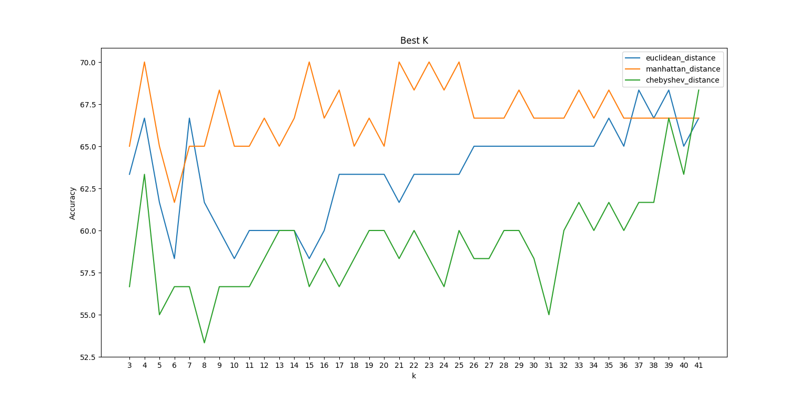
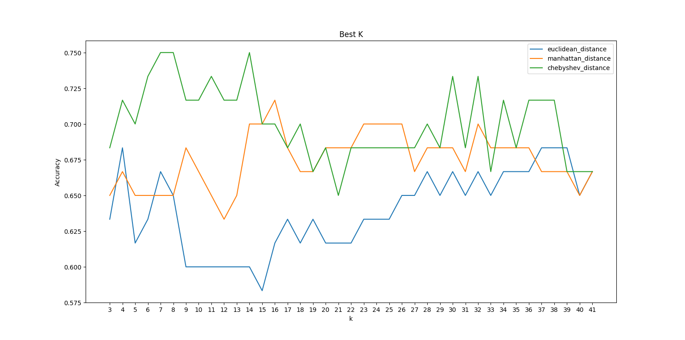
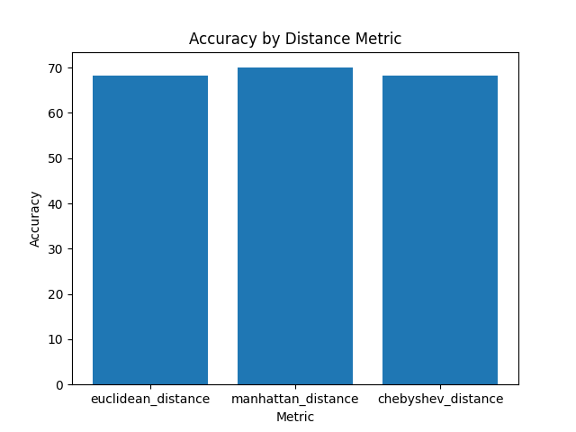
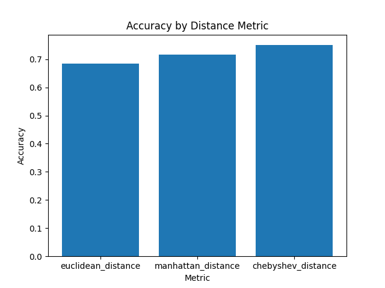
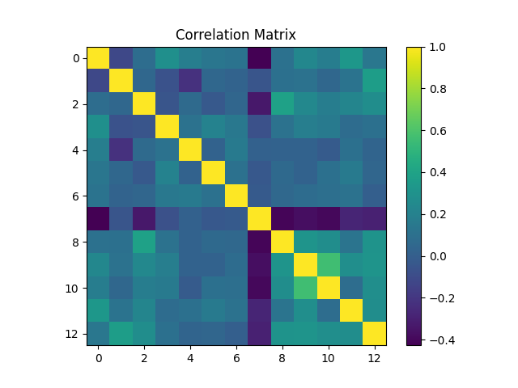
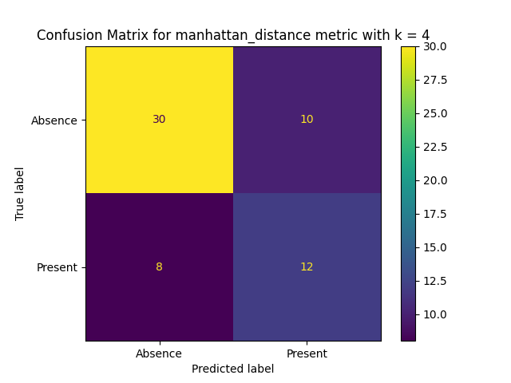
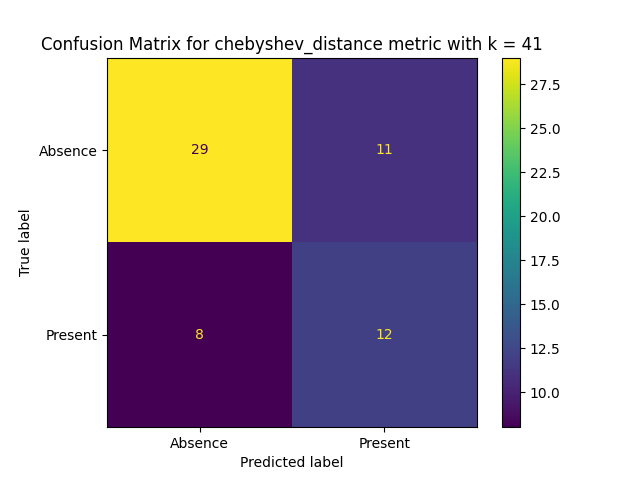
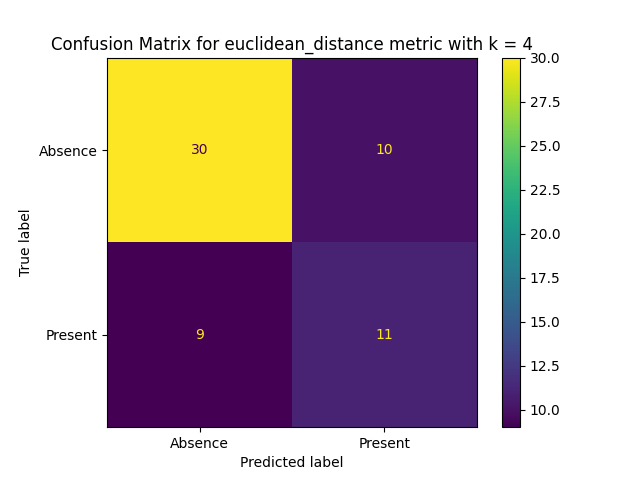
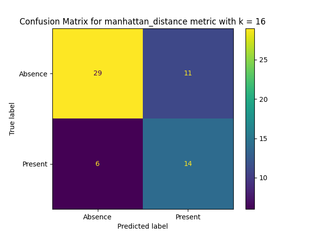
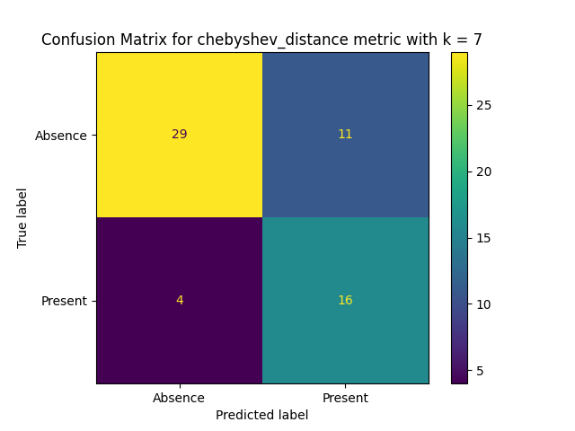

# K-Nearest Neighbors

**Author**: Mario Ignacio Frias Piña  
**Assignment**: Advanced Artificial Intelligence for Data Science I  
**Teacher**: Dr. Esteban Castillo Juarez  
**Date**: August 14 2024

## Introduction

Despite its simplicity, KNN is powerful and widely used across various applications, from image recognition to predictive modeling in finance and healthcare.

Unlike many machine learning models that rely on training parameters and constructing a generalized model, KNN makes decisions based on the closest data points in the feature space. This "lazy learning" approach allows KNN to be highly flexible and adaptive, making it particularly effective for datasets where the relationships between data points are complex or non-linear.

In this project, we will explore the KNN algorithm's theoretical foundations, its implementation, and its application to real-world datasets. We will delve into how the algorithm classifies new data points by analyzing the majority class among its 'k' nearest neighbors, discuss the impact of different distance metrics and the choice of 'k', and examine the strengths and limitations of the algorithm.

## Experimentation

### KNN Algorithm

The k-nearest neighbors (KNN) algorithm is a non-parametric, supervised learning classifier, which uses proximity to make classifications or predictions about the grouping of an individual data point. It is one of the popular and simplest classification and regression classifiers used in machine learning today. [IBM](https://www.ibm.com/topics/knn)

### Distance metrics

The distance metrics used are Euclidean, Manhattan, and Chebyshev.

#### Euclidean distance

The Euclidean distance is the square root of the sum of the squared differences between the elements of the two vectors. This distance is the distance between two points in Euclidean space.

#### Manhattan distance

The Manhattan distance is the sum of the absolute differences between the elements of the two vectors. This distance is the distance between two points in the city block metric where you can move horizontally or vertically, but not diagonally.

#### Chebyshev distance

The Chebyshev distance is the maximum of the absolute differences between the elements of the two vectors. This distance compares each coordinate individually and returns the biggest one.

### The dataset

For this project we utilized a dataset containing 14 features and 303 samples. The dataset was obtained from the [UCI Machine Learning Repository](https://archive.ics.uci.edu/ml/datasets/Heart+Disease). This dataset contains information about patients' clinical data, and is used to classify patients into two classes: **presence of heart disease** and **absence of heart disease**.

The features in the dataset are as follows:

| Feature  | Description                                        | Possible values                                                                                                                                    |
| -------- | -------------------------------------------------- | -------------------------------------------------------------------------------------------------------------------------------------------------- |
| age      | Age                                                | years                                                                                                                                              |
| sex      | Sex                                                | 1 = male   0 = female                                                                                                                           |
| cp       | Chest pain type                                    | 1 = typical angina   2 = atypical angina   3 = non-anginal pain   4 = asymptomatic                                                        |
| trestbps | Resting blood pressure                             | mm Hg                                                                                                                                              |
| chol     | Serum cholestoral                                  | mg/dl                                                                                                                                              |
| fbs      | fasting blood sugar                                | 1 = greater than 120 mg/dl   0 = less than 120 mg/dl                                                                                            |
| restecg  | Resting electrocardiographic results               | 0 = normalchebyshev_distance 1 = having ST-T wave abnormality  2 = showing probable or definite left ventricular hypertrophy by Estes' criteria |
| thalach  | Maximum heart rate achieved                        | bpm                                                                                                                                                |
| exang    | Exercise induced angina                            | 1 = yes   0 = no                                                                                                                                |
| oldpeak  | ST depression induced by exercise relative to rest | ---                                                                                                                                                |
| slope    | Slope of the peak exercise ST segment              | 1 = upsloping   2 = flat   3 = downsloping                                                                                                   |
| ca       | Number of major vessels                            | (0-3) colored by fluoroscopy                                                                                                                       |
| thal     | Thalassemia                                        | 3 = normal   6 = fixed defect   7 = reversable defect                                                                                        |
| target   | Presence of heart disease                          | 1 = yes   0 = no                                                                                                                                |

### Implementing KNN

We will implement the KNN algorithm in Python both using the scikit-learn library and manually.

For the scikit-learn implementation, we will use the [KNeighborsClassifier](https://scikit-learn.org/stable/modules/generated/sklearn.neighbors.KNeighborsClassifier.html) from the scikit-learn library.

For these implementations we will use 3 different distance metrics: Euclidean, Manhattan, and Chebyshev. We will also use different values of k, ranging from 3 to 41.

We will compare the performance of the KNN algorithm using different values of k, distance metrics, and the different implementations (manually and using the scikit-learn library).

To evaluate the performance of the KNN algorithm, we will use the [accuracy_score](https://scikit-learn.org/stable/modules/generated/sklearn.metrics.accuracy_score.html) and the [ConfusionMatrixDisplay](https://scikit-learn.org/stable/modules/generated/sklearn.metrics.ConfusionMatrixDisplay.html) from the scikit-learn library. And the correlation matrix from the pandas library to plot the correlation between the different features.

We will also use the [matplotlib](https://matplotlib.org/) library to plot the different results.

## Results

#### The results of the KNN algorithm using the different implementations (manually and using the scikit-learn library) are shown below.

The graph below shows the accuracy of the KNN algorithm using different values of k, distance metrics, and the different implementations (manually and using the scikit-learn library).

The graphs below show the accuracy of the best value of k for each distance metric.

The graphs below show the correlation between the different features, in the order shown in the table from the previous section.

The confusion matrices below show the results of the KNN algorithm using the best values of k for each distance metric, and the different implementations (manually and using the scikit-learn library).

**Manual Confusion Matrices**

**Scikit-learn Confusion Matrices**

## Conclusions

#### Comparison of different metrics

For this dataset and for the manual implementation, the Manhattan distance metric seems to be the best choice for maximizing the accuracy of the KNN algorithm, particularly with 𝑘 values around 7 to 11. Euclidean distance is a viable alternative, especially with higher 𝑘 values, while Chebyshev distance is not recommended due to its lower and inconsistent accuracy.

While for the scikit-learn implementation, the best metric is reversed, with the Chebyshev distance being the best choice.

#### Comparison of different implementations

The scikit-learn implementation is the best choice for this dataset, as it reaches the highest accuracy and is faster to compute.

#### Comparison of different values of k

There is no significant difference in the accuracy of the KNN algorithm using the different values of k, with the same distance metric.

#### Conclusion

For this dataset, the KNN algorithm reaches an accuracy of about 70% which is a good result. But no matter the choice of K-value, distance metric, or implementation, the KNN algorithm cannot achieve a higher accuracy than 80%.

It can solve the classification problem, but it is not a good enough model to be used for prediction in real-world scenarios that require high accuracy. Such as in the healthcare industry.