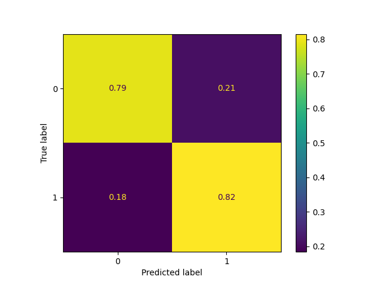
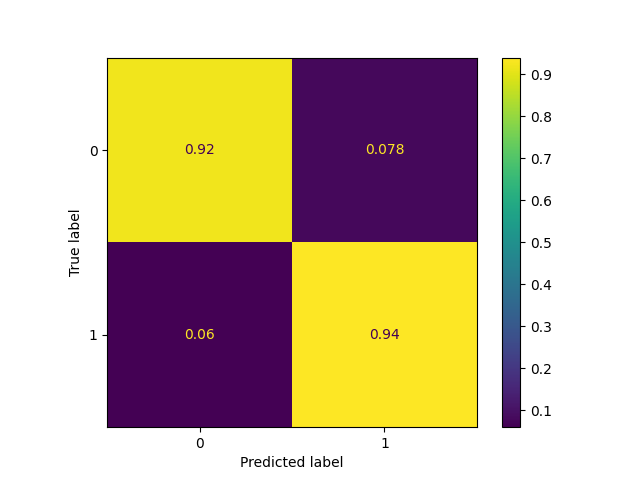
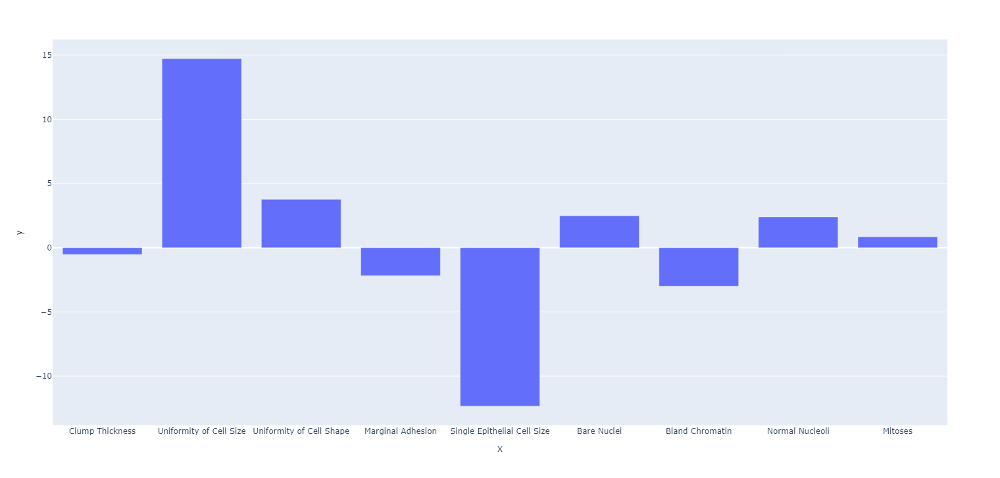
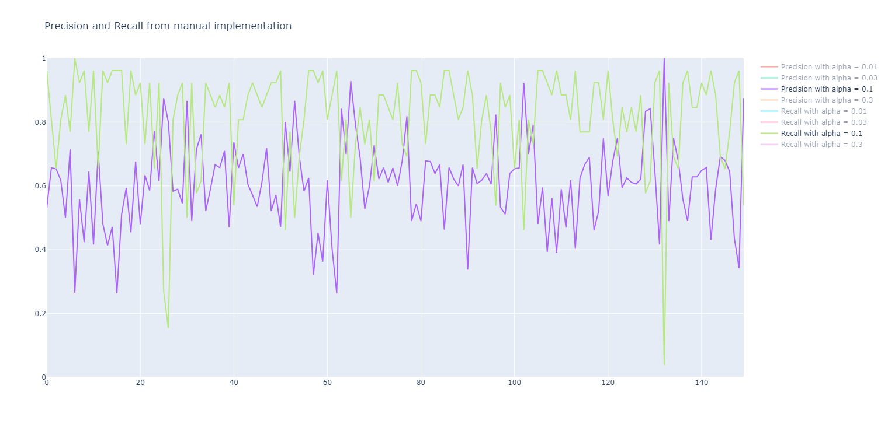
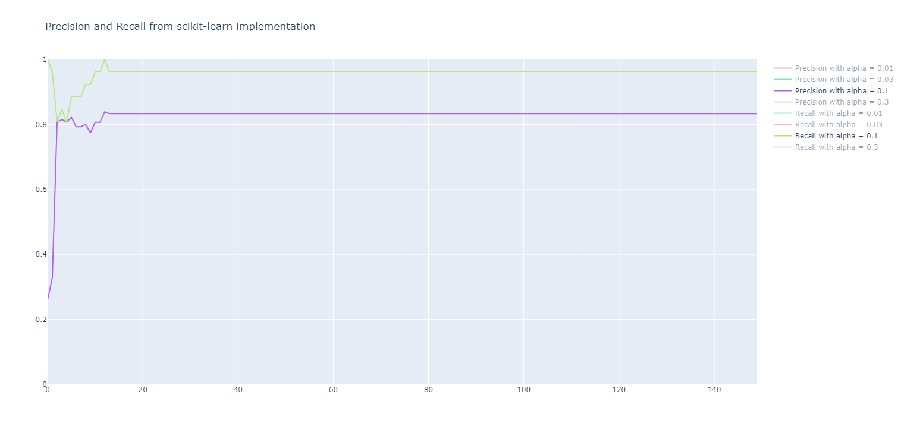

# Logistic Regression

**Author**: Mario Ignacio Frias Piña  
**Assignment**: Advanced Artificial Intelligence for Data Science I  
**Teacher**: Dr. Esteban Castillo Juarez  
**Date**: August 24 2024

## Introduction

This project will explore the Logistic Regression algorithm. It is a non-parametric, supervised learning classifier, which uses proximity to make classifications or predictions about the grouping of an individual data point. It is one of the most popular and simplest classification and regression classifiers used in machine learning.

## Experimentation

### Logistic Regression Algorithm

Logistic regression estimates the probability of an event occurring, such as voted or didn’t vote, based on a given data set of independent variables. [IBM](https://www.ibm.com/topics/logistic-regression)

The way this algorithm works is based on minimizing the error function between the predicted probability and the actual outcome. The way it is minimized is through a gradient descent algorithm, which is an iterative optimization method that applies an update rule to the weights of the model so that this weights better fit the training data.

The gradient descent algorithm works through the following steps:

1. Calculate the predicted probability from the weights
2. Calculate the error between the predicted probability and the actual outcome
3. Calculate the gradient of the error
4. Update the weights
5. Repeat until convergence

How we penalize the weights for bigger errors is through the activation function that is used, where the farther the predicted outcome is to the actual outcome, the bigger the penalty is.

### Activation function

The activation functions used are sigmoid, tanh, and relu. They are used to map the predicted outcome to a value between two points.

#### Sigmoid

The sigmoid function is used to map the predicted outcome to a value between 0 and 1.

    f(x) = 1 / (1 + e^(-x))

#### Tanh

The Tanh function is used to map the predicted outcome to a value between -1 and 1.

    f(x) = (e^x - e^(-x)) / (e^x + e^(-x))

#### ReLU

The relu function is used to map the predicted outcome to a value between 0 and infinity.

    f(x) = max(0, x)

Each of these functions can be used to map values to a range that is known beforehand, and can be used in machine learning to improve the accuracy of the model.

### The dataset

For this project we will use the [Breast Cancer Wisconsin (Diagnostic) dataset](https://archive.ics.uci.edu/dataset/15/breast+cancer+wisconsin+original). The dataset contains 599 training examples, 100 testing examples and 9 features.

| Feature                     | Data Type |
| :-------------------------- | :-------- |
| Clump Thickness             | Integer   |
| Uniformity of Cell Size     | Integer   |
| Uniformity of Cell Shape    | Integer   |
| Marginal Adhesion           | Integer   |
| Single Epithelial Cell Size | Integer   |
| Bare Nuclei                 | Integer   |
| Bland Chromatin             | Integer   |
| Normal Nucleoli             | Integer   |
| Mitoses                     | Integer   |

The data is divided into 2 classes: benign and malignant. Which is indicated by the last column.

### Implementing Logistic Regression

We will implement the Logistic Regression algorithm in Python both using the scikit-learn library and manually.

For the scikit-learn implementation, we will use the [LogisticRegression](https://scikit-learn.org/stable/modules/generated/sklearn.linear_model.LogisticRegression.html) function from the scikit-learn library.

For these implementations we will use 3 different activation functions: sigmoid, tanh, and relu. We will also track the results with different values for alpha, the learning rate, and the number of iterations.

To evaluate the performance of the Logistic Regression algorithm, we will use the [precision_score](https://scikit-learn.org/stable/modules/generated/sklearn.metrics.precision_score.html), [recall_score](https://scikit-learn.org/stable/modules/generated/sklearn.metrics.recall_score.html) and the [ConfusionMatrixDisplay](https://scikit-learn.org/stable/modules/generated/sklearn.metrics.ConfusionMatrixDisplay.html) from the scikit-learn library. We will also plot the importance of each feature from the final calculated weights in the order shown in the table from the previous section.

The graphs below use both the [matplotlib](https://matplotlib.org/) library to plot the Confusion Matrix and the [plotly](https://plotly.com/) library to plot the feature importance, precision and recall scores.

## Results

#### The results of the Logistic Regression algorithm using the different implementations (manually and using the scikit-learn library) are shown below.

The Confusion Matrices below show the average results of the Logistic Regression algorithm using the different implementations (manually and using the scikit-learn library) for the different values of alpha, the learning rate, and the number of iterations.

**Confusion Matrix using the manually implemented Logistic Regression algorithm**

**Confusion Matrix using the scikit-learn library**

The graph below shows the importance of each feature from the final calculated weights in the order shown in the table from the previous section. The feature importance is used to determine which features are more important for the model to predict the outcome correctly.

**Feature importance**

The graphs below show the precision and recall scores for the Logistic Regression algorithm using the different implementations (manually and using the scikit-learn library).

Precision is the ratio of true positives to the sum of true positives and false positives.

    Precision = TP / (TP + FP)

Recall is the ratio of true positives to the sum of true positives and false negatives.

    Recall = TP / (TP + FN)

**Precision and recall scores using the manually implemented Logistic Regression algorithm**

**Precision and recall scores using the scikit-learn library**

## Conclusions

#### Difference between the manual and scikit-learn implementations

The scikit-learn implementation is more accurate than the manual implementation, it gets an average accuracy of over 90% while the manual implementation gets an average accuracy of around 80%. As seen from the Correlation Matrix.

It also is way more consistant than the manual implementation where once it reaches the highest accuracy, it stays there for the rest of the dataset. While the manual implementation is bumpier, where it fluctuates wildly in its scores.

#### Feature importance

"Uniformity of Cell Size" is the most important feature, as it has the highest positive value on the y-axis.

"Single Epithelial Cell Size" has the most negative importance, indicating that its relationship with the target variable is inversely proportional or that it decreases the model's predictive power when it increases.

The other features have less importance in the model.

#### Conclusion

The Logistic Regression algorithm is an accurate model that can be used for classification. As seen from the results, it is a good model to use for prediction in real-world scenarios. It has good accuracy for both the manual and scikit-learn implementations, but it is not perfect for prediction.

For problems that are linearly separable, the Logistic Regression algorithm is a good model to use for classification, as it is an accurate and fast model that only needs to be given good training data.
